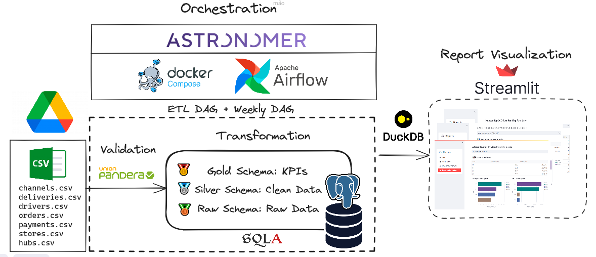
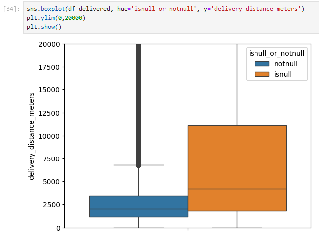
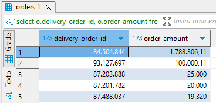
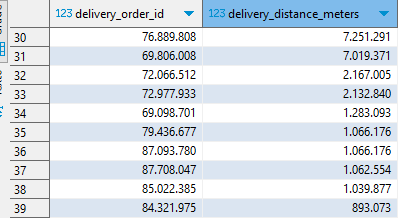
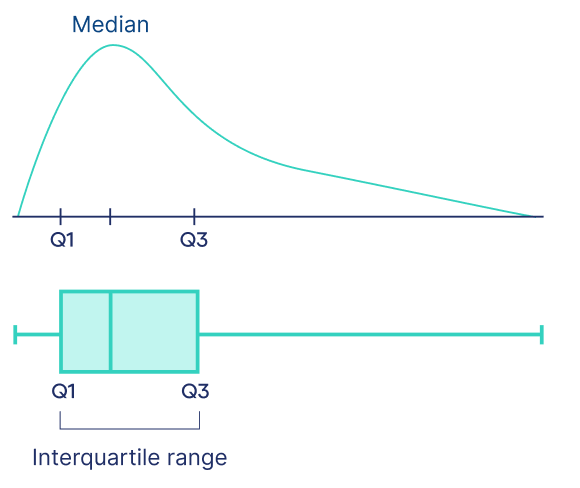

Online Report: https://airflow-foodcenter.onrender.com  
  
# Overview:
 
  
The dataset from this project can be found [here in kaggle](https://www.kaggle.com/datasets/nosbielcs/brazilian-delivery-center).  
The main idea was to do a EDA (Exploratory Data Analysis) on this data to answer some question, but I saw a good oportunity to flex some Airflow skills that I recently learned on the workshop of data engineering.  
  
## Tasks: 
- Marketing Action: In a marketing action to attract more delivery drivers, we will offer a bonus to the top 20 drivers who have traveled the longest distances overall. The bonus will vary according to the type of professional they are and the mode of transportation they use (motorcycle, bike, etc). Gather this information.
  
- Pricing Team Requirement: Additionally, the Pricing team needs to adjust the payments to the delivery drivers. For this purpose, they require the distribution of the average distance traveled by motorcyclists separated by state since each region will have its own pricing.
  
- CFO's Requirement: Finally, the CFO needs some revenue indicators to present to the executive board. Among these indicators, you will need to gather (1) the average and total revenue separated by type (Food vs. Goods), (2) the average and total revenue per state. In other words, there are 4 tables in total. 
  
## Modelling:  
The modelling design was mainly based on the tasks at proposed. You can see the EDA on the jupyter notebook found in the repository at the notebook folder.  
Also, all the tranformation queries can be found in the directory: include/sql.  
Main decision:  
- Remove orders where driver_id was **Null**.  
- Filter out by **delivered** orders.  
- Remove outliers of distance and order value using IQR method.  
- Aggregate order value and city/state for each order.  
- Calculate the proportion of drivers by modal and type to make a segmented ranking. 

### Steps:     
#### Filter out by delivered and null:  
For both task: revenues and rewarding drivers by total distance travelled, it would be fair to take into account only the delivered orders. 
During EDA was also spotted some probable frauds or bugs in both, distance metric and order value.  
**Worth mention** that most of those anomaly results was found in rows where driver_id was null. So null values was also removed.  
  
```sql
CREATE VIEW silver.delivered_v AS
WITH delivered_v AS (
    select d.*,
	o.order_amount ,
	o.order_created_day ,
	o.order_created_month ,
	o.order_created_year ,
	s.store_id ,
	s.store_name ,
	s.store_segment ,
	s.store_plan_price ,
	h.hub_name ,
	h.hub_city ,
	h.hub_state
	FROM 
	raw.deliveries d  
	JOIN raw.orders o ON d.delivery_order_id = o.delivery_order_id 
	JOIN raw.stores s ON o.store_id = s.store_id 
	JOIN raw.hubs h ON s.hub_id = h.hub_id
	WHERE d.delivery_status = UPPER('delivered')
),

delivered_notnull AS (
    SELECT dd.*
    FROM delivered_v dd
    WHERE dd.driver_id IS NOT NULL
)
SELECT *
FROM delivered_notnull;
```
A boxplot of the distribution of distance for data with no null driver_id and only null driver_id values:  

  
#### Outliers:  
As mentioned before, some of the spotted anomalies were in distance and value of the orders. Even though removing null values removed most of outliers, some remained. In raw data we can find:  


  
Method choose to remove those outliers was by positively skewed IQR (Interquartile Range).  
  
By the nature of the event the distribution is skewed for the right, and so, anomalies at the right tail was removed on the silver tier.  
```sql
CREATE VIEW silver.delivered_no_distance_outliers_v AS
with quartiles as (
    SELECT  
        percentile_cont(0.25) WITHIN GROUP (ORDER BY delivery_distance_meters) AS Q1,
        percentile_cont(0.75) WITHIN GROUP (ORDER BY delivery_distance_meters) AS Q3
    FROM silver.dv
	),
	
	iqr AS (
    SELECT quartiles.Q3 - quartiles.Q1 AS IQR
    FROM quartiles
	),
	
	bounds AS (
    SELECT quartiles.Q3 + 1.5 *iqr.IQR AS upper_bound
    FROM quartiles, iqr
	),
	
	delivered_no_outliers AS (
	SELECT * FROM 
    silver.delivered_v dv
	JOIN 
    bounds
	ON 
    silver.dv.delivery_distance_meters <= bounds.upper_bound
	)
	SELECT dv.* FROM delivered_no_outliers
;
--outliers in order amount 
CREATE MATERIALIZED VIEW silver.clean_delivered_mv AS
WITH quartiles AS (
    SELECT  
        percentile_cont(0.25) WITHIN GROUP (ORDER BY order_amount) AS Q1,
        percentile_cont(0.75) WITHIN GROUP (ORDER BY order_amount) AS Q3
    FROM silver.delivered_no_distance_outliers_v
	),
	
	iqr AS (
    SELECT quartiles.Q3 - quartiles.Q1 AS IQR
    FROM quartiles
	),
	
	bounds AS (
    SELECT quartiles.Q3 + 1.5 *iqr.IQR AS upper_bound
    FROM quartiles, iqr
	),
	
	delivered_no_outliers AS (
	SELECT dv.* FROM 
    silver.delivered_no_distance_outliers_v dv
	JOIN 
    bounds
	ON 
    silver.dv.delivery_distance_meters <= bounds.upper_bound
	)
	SELECT * FROM delivered_no_outliers
;
```
  
#### Ranking:  
First I created a general ranking without segmenting by the modals and types:  
```sql
CREATE MATERIALIZED VIEW silver.ranking_all_mv AS
	WITH all_rank_drivers AS (
		SELECT 
		cd.driver_id,
		d.driver_modal,
		d.driver_type,
        SUM(cd.order_amount) AS sum_of_amount_of_orders,
		SUM(cd.delivery_distance_meters) AS sum_of_distance,
        MAX(cd.delivery_distance_meters) AS max_distance,
    	RANK() OVER (ORDER BY SUM(delivery_distance_meters) DESC) AS ranking
		FROM 
    	silver.clean_delivered_mv cd
    	JOIN raw.drivers d ON cd.driver_id = d.driver_id
		GROUP BY cd.driver_id, d.driver_modal, d.driver_type
	)
	SELECT * FROM all_rank_drivers
;
```
For the segmented ranking I first calculated the proportion of each combination of type and modal, there are 4 combinations. Also I used PL(Procedural Language) SQL to create tables with the date of creation to keep track of until which date the calculation took into account.  
Here a snippet of the query  (the whole code is in sql directory file "creating.sql"):  
```sql
DO $$
BEGIN
    EXECUTE 'CREATE TABLE gold.top20_ranking_stratified_' || to_char(current_date, 'YYYY_MM_DD') || ' AS
        WITH clean_drivers AS (
            SELECT DISTINCT
                cd.driver_id,
                d.driver_modal,
                d.driver_type
            FROM 
                silver.clean_delivered_mv cd
            JOIN 
                raw.drivers d ON cd.driver_id = d.driver_id
        ),
proportion AS (
            SELECT 
                driver_modal,
                driver_type,
                COUNT(driver_id) AS counting,
                ROUND(COUNT(driver_id)::numeric / sum(COUNT(driver_id)) OVER () * 16) AS proportion
            FROM 
                clean_drivers
            GROUP BY 
                driver_modal, driver_type
        ),
```
## Tools Overview:  
  
### Orchestration:
[](https://docs.astronomer.io/astro/cli/install-cli)  
For the ETL (Extract Transform Load) I used astronomer. Astronomer is a solution that builds in the whole infraestructure for Airflow server.  It uses **Docker Compose** to download the necessary images for Airflow and build them:
  
  
  
### Validation:  
[](https://pandera.readthedocs.io/en/stable/)  
To validate each table that would be loaded to the database I choose pandera because it is fast and seamlessly integrates with pandas dataframes.  
  
### Database:  
[](https://render.com/)  
To load the raw data as well as the silver and gold tiers I choose PostgreSQL that is offered by render.com. They have a free tier database that is enough for this application.  
  
### Transformation (ORM):  
[](https://www.sqlalchemy.org/)  
The function that handles the processing of the queries to make the transformations uses the ORM SqlAlchemy. It is developed as a ORM (Object-Relational Mapping) for python. It maps python classes to database tables and vice versa. To integrate with postgreSQL databases it also requires Psycopg.  

### Visualization:  
[](https://duckdb.org/)  
To build the backend responsible to retrieves the data from gold tier I mainly used Duckdb. It is fast and and developed for analytical purposes like this. Finally, all the pages and dashboads was build on streamlit. It is robust and easy to implement.


# Installing and Start:  

## Clone repo:  
```bash
git clone https://github.com/thomasfsr/airflow_foodcenter
cd airflow_foodcenter
```
## Install Astronomer:  
To run this project, you will need to install `astro-cli`, which will facilitate the installation of Airflow:  
```bash
brew install astro 
``` 
Before starting Airflow via `astro-cli`, some environment variables need to be specified in a `.env` file at the root of the project:  
```
#Google Drive folder
folder_id = 1ek2v3SC1aPAfWmkcbZUl9Cxg0uKNIase

#postgre 
username = ***  
password = ***  
host = ***  
port = 5432
database_name = ***  
external_url = ***  
```
  
Obs.: The folder_id is not hidden because it is public. However, if you want to download the data yourself, it is hosted: https://www.kaggle.com/datasets/nosbielcs/brazilian-delivery-center
  
- Start Airflow:  
```bash
astro dev start wait=20m
``` 
  
- DAG order:  
In the Airflow dashboard, the DAG etldag should be initiated first, and once it is completed, the DAG weekly_dag can be initiated.    
  
- The first DAG will load the tables from Google Drive, validate the columns with Pandera, and, once validated, will load the tables into the "Raw" schema of the PostgreSQL database.

- Subsequently, two other schemas, "Silver" and "Gold", will be created.
    - Silver: Views and Materialized Views with cleaned data, concatenating the necessary data for KPI calculations.
    - Gold: KPI tables using values updated up to that period.
  
- The DAG weekly_dag is responsable to refresh the views, MVs and create new updated tables.  
  
## Streamlit Report:  
First install the dependencies with poetry:  
(If poetry is not installed: pip install poetry)  

```bash
poetry shell  
poetry install  
```
Run the application:   
```bash  
streamlit run app/main.py  
```


