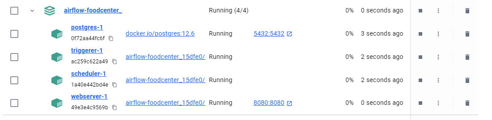
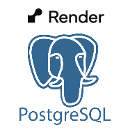

Online Report: https://airflow-foodcenter.onrender.com  
  
# Overview:
The dataset from this project can be found [here in kaggle](https://www.kaggle.com/datasets/nosbielcs/brazilian-delivery-center).  
The main idea was to do a EDA (Exploratory Data Analysis) on this data to answer some question, but I saw a good oportunity to flex some Airflow skills that I recently learned on the workshop of data engineering.  
  
## Tasks: 
- Marketing Action: In a marketing action to attract more delivery drivers, we will offer a bonus to the top 20 drivers who have traveled the longest distances overall. The bonus will vary according to the type of professional they are and the mode of transportation they use (motorcycle, bike, etc). Gather this information.
  
- Pricing Team Requirement: Additionally, the Pricing team needs to adjust the payments to the delivery drivers. For this purpose, they require the distribution of the average distance traveled by motorcyclists separated by state since each region will have its own pricing.
  
- CFO's Requirement: Finally, the CFO needs some revenue indicators to present to the executive board. Among these indicators, you will need to gather (1) the average and total revenue separated by type (Food vs. Goods), (2) the average and total revenue per state. In other words, there are 4 tables in total. 
  

## Tools Overview:  
  
### Orchestration:
[](https://docs.astronomer.io/astro/cli/install-cli)  
For the ETL (Extract Transform Load) I used astronomer. Astronomer is a solution that builds in the whole infraestructure for Airflow server.  It uses **Docker Compose** to download the necessary images for Airflow and build them:
  
  
  
### Validation:  
[](https://pandera.readthedocs.io/en/stable/)  
To validate each table that would be loaded to the database I choose pandera because it is fast and seamlessly integrates with pandas dataframes.  
  
### Database:  
[](https://render.com/)  
To load the raw data as well as the silver and gold tiers I choose PostgreSQL that is offered by render.com. They have a free tier database that is enough for this application.  
  
### Transformation (ORM):  
[](https://www.sqlalchemy.org/)  
The function that handles the processing of the queries to make the transformations uses the ORM SqlAlchemy. It is developed as a ORM (Object-Relational Mapping) for python. It maps python classes to database tables and vice versa. To integrate with postgreSQL databases it also requires Psycopg.  

### Visualization:  
[](https://duckdb.org/)  
To build the backend responsible to retrieves the data from gold tier I mainly used Duckdb. It is fast and and developed for analytical purposes like this. Finally, all the pages and dashboads was build on streamlit. It is robust and easy to implement.


# Installing and Start:  

## Clone repo:  
```bash
git clone https://github.com/thomasfsr/airflow_foodcenter
cd airflow_foodcenter
```
## Install Astronomer:  
To run this project, you will need to install `astro-cli`, which will facilitate the installation of Airflow:  
```bash
brew install astro 
``` 
Before starting Airflow via `astro-cli`, some environment variables need to be specified in a `.env` file at the root of the project:  
```
#Google Drive folder
folder_id = 1ek2v3SC1aPAfWmkcbZUl9Cxg0uKNIase

#postgre 
username = ***  
password = ***  
host = ***  
port = 5432
database_name = ***  
external_url = ***  
```
  
Obs.: The folder_id is not hidden because it is public. However, if you want to download the data yourself, it is hosted: https://www.kaggle.com/datasets/nosbielcs/brazilian-delivery-center
  
- Start Airflow:  
```bash
astro dev start wait=20m
``` 
  
- DAG order:  
In the Airflow dashboard, the DAG etldag should be initiated first, and once it is completed, the DAG weekly_dag can be initiated.    
  
- The first DAG will load the tables from Google Drive, validate the columns with Pandera, and, once validated, will load the tables into the "Raw" schema of the PostgreSQL database.

- Subsequently, two other schemas, "Silver" and "Gold", will be created.
    - Silver: Views and Materialized Views with cleaned data, concatenating the necessary data for KPI calculations.
    - Gold: KPI tables using values updated up to that period.
  
- The DAG weekly_dag is responsable to refresh the views, MVs and create new updated tables.  
  
## Streamlit Report:  
First install the dependencies with poetry:  
(If poetry is not installed: pip install poetry)  

```bash
poetry shell  
poetry install  
```
Run the application:   
```bash  
streamlit run app/main.py  
```


